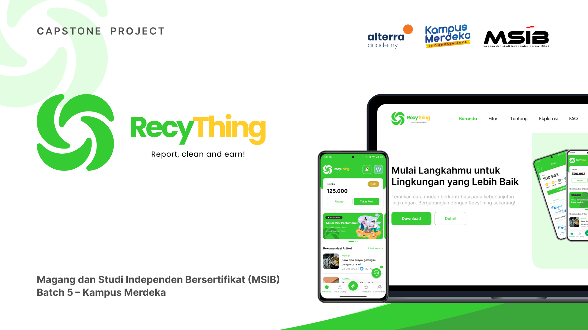

+++
archetype = ""
title = "RecyThing"
weight = 2
+++

## About

Introducing RecyThing is an innovative application to help overcome problems surrounding waste, recycling, and reporting piles and waste disposal violations. This application is equipped with gamification so that users get profitable benefits from participating in daily missions or other events.

## Features

On the website 💻 with the following features:
- Landing Pages
- Login Page
- Analytical Dashboard
- Manage Users
- Manage Admins
- Manage Data Reporting
- Manage Achievements
- Manage Articles
- Manage Missions
- Manage Trash Categories
- Manage Drop Points
- Manage Vouchers
- Manage Voucher Exchange
- Manage Recycling
- Manage Community
- Manage Custom Data for OpenAI (AI)

On the mobile 📱 side with the following features:
- Join Membership (Register)
- RecyBot (AI Chatbot & Virtual Assistant)
- exchange points
- Daily Points
- Report Littering
- Report Rubbish
- Article
- Drop Point Info
- Participate in the mission
- Community
- Customer Service

## Tech Stack

- Go
- Echo
- GORM
- Mysql
- Docker
- Cloudflare
- Google Cloud Run
- Swagger
- Open AI
- Codecov

## Team Members

Our team consists of 5 divisions 👨‍💻 :
1. UI/UX Division = 9 members
2. React Division = 9 members
3. Flutter Division = 5 members
4. Golang Division = 5 members
5. Quality Assurance Division = 2 members